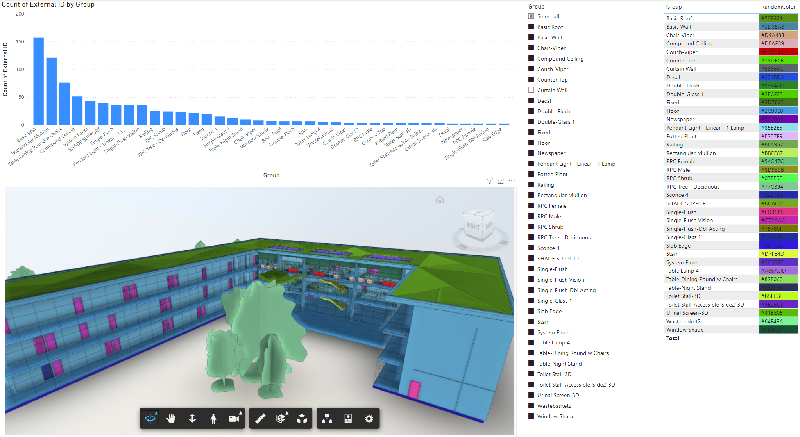

# APS PowerBI Tools APAC

## Acknowledgement
Source codes shared in this repo were originated from open source porjects shared by [Autodesk Platform Services](https://github.com/autodesk-platform-services) and [Petr Broz](https://github.com/petrbroz):
- _https://github.com/autodesk-platform-services/aps-powerbi-tools_
- _https://github.com/petrbroz/vscode-forge-tools_

Source codes have been updated to support the newly established APAC region (Australia) of Autodesk Construction Cloud.

## BILT ANZ 2024
This repo is for sharing all source codes and context for the presentation **"Enabling 3d model viewer in Power BI using APS Viewer API"** on BILT ANZ 2024 in Melbourne. Will seek the opportunity to merge all updates back to their original repositories.

## Content

Collection of the tools for accessing [Autodesk Platform Services](https://aps.autodesk.com) design data - 2D/3D views as well as element properties - from [Power BI](https://powerbi.com) reports.

[Link to Power BI Demo Report](https://app.powerbi.com/view?r=eyJrIjoiNDE5NDViMjctZGUzYS00NDgyLTg1MGEtMTIyOTFiYzEzNGQwIiwidCI6ImJkMTNhZjA1LTE4YWEtNDQ2My1hMjhkLWVkYmNiMjdmMWUwMiJ9)

### Tools

- **aps-viewer-visual-apac** - A Power BI custom visual which integrats APS Model Viewer. Updated to support models from ACC APAC region by acquiring the access token from _aps-shares-app_.
- **aps-shares-app** - A web app to register the model sharing from ACC and feeding the model access token back to Power BI Custom Visual. This is about the same as its original version.
- **aps-props-connector-apac** - This is the Power BI custom data connector to directly read model properties from all elements inside Power BI using [APS Model Derivative API](https://aps.autodesk.com/developer/overview/model-derivative-api). Updated to support ACC APAC region.
- **vscode-forge-tools-apac** - [Visual Studio Code](https://code.visualstudio.com) extension for accessing [Autodesk Platform Services](https://aps.autodesk.com) services and content. This tool can help the users to get all inputs to Power BI APS Model Viewer, such as the unique identifier of the model (URN), model view id, and the properties of all elements.

### Major Updates

#### 25/08/2024
- Including vscode-forge-tools-apac, updated to support ACC APAC Region.

#### 20/08/2024
- Supporting ACC APAC region (Australia) by Power BI Visual and Data Connector
- Updated development dependency to the current version
- For Power BI Visual, Colorising geometry elements based on their categories

For more information, please find the README file of each individual tool.

## Troubleshooting

- For the updated codes, please contact me via apsdev.biltanz@gmail.com.
- For general APS questions, please contact Autodesk via https://aps.autodesk.com/get-help.

## License

This sample is licensed under the terms of the [MIT License](http://opensource.org/licenses/MIT). Please see the [LICENSE](LICENSE) file for more details.
