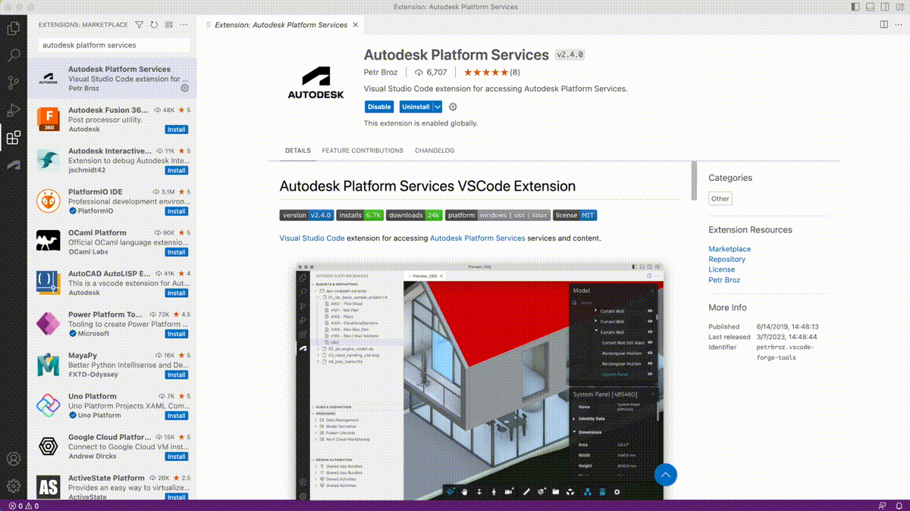
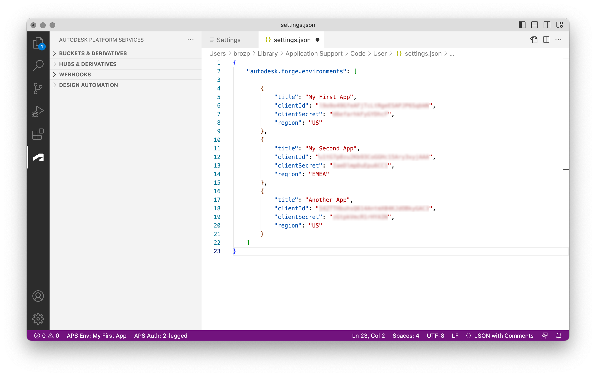
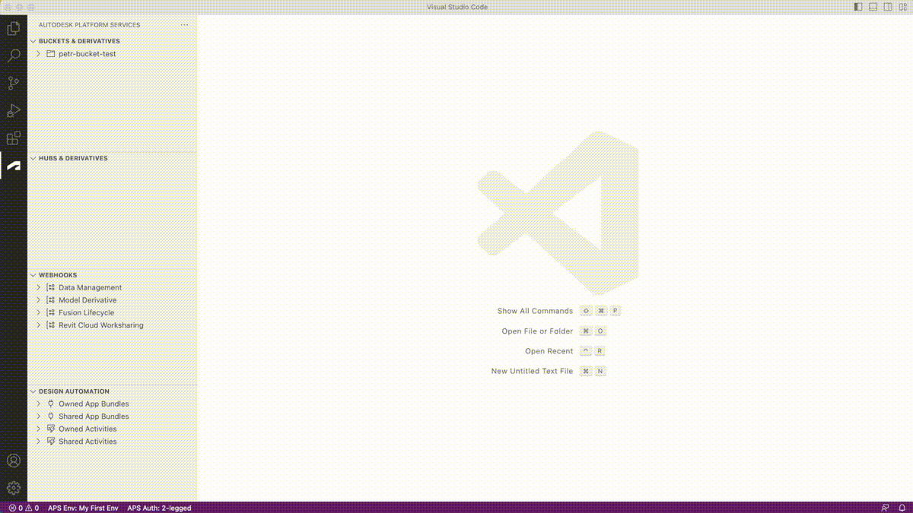
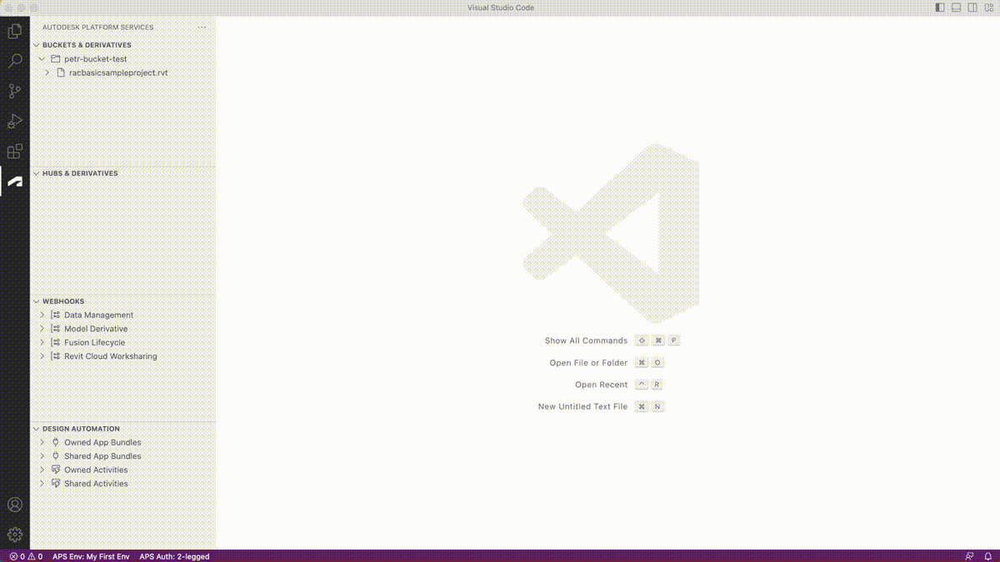

# Autodesk Platform Services (VSCode Extension)

## Acknowledgement
Source codes shared in this repo were originated from open-source project shared by [Petr Broz](https://github.com/petrbroz):
- _https://github.com/petrbroz/vscode-forge-tools_

Source codes have been updated to support the newly established APAC region (Australia) of Autodesk Construction Cloud.

## Original Context (with updates)

[Visual Studio Code](https://code.visualstudio.com) extension for accessing [Autodesk Platform Services](https://aps.autodesk.com) services and content.

> Note: [Autodesk Forge is now Autodesk Platform Services](https://aps.autodesk.com/blog/autodesk-forge-becoming-autodesk-platform-services) but you may still see the _Forge_ brand used in different areas of this extension. These references have been kept to maintain backwards compatibility.

## Requirements

- [Visual Studio Code](https://code.visualstudio.com) version **1.92.0** or newer
- APS app credentials ([tutorial](https://aps.autodesk.com/en/docs/oauth/v2/tutorials/create-app))

## Installation

While in Visual Studio Code:

1. Switch to the _Extensions_ sidebar (`Cmd`+`Shift`+`X` on macOS or `Ctrl`+`Shift`+`X` on Windows), search for the _Autodesk Platform Services_ extension, and install it. :warning: The current verion of this extension found from the extension marketplace does note support ACC Region. You can find the deployalbe `vscode-forge-tools-apac-2.7.1.vsix` file from **_root_** folder and install it manually by following this article on medium.com: (https://medium.com/@malekrizwan08/how-to-install-any-extension-in-visual-studio-code-manually-39bad1908cd4).

2. When you activate the _Autodesk Platform Services_ extension for the first time, it'll guide you through creating your first "environment". An environment is basically a configuration for a specific APS application, including its client ID and secret, or region, for example.

> You can configure additional environments or update existing ones by going to _User Settings_ (`Cmd`+`,` on macOS or `Ctrl`+`,` on Windows), searching for _autodesk environments_, clicking the _Edit in settings.json_ link, and modifying the JSON settings manually. Switch to _User_ or _Workspace_ tab depending on whether you want to persist the settings globally (for all instances of the editor) or locally (only for a specific workspace).

## Extension Settings

The extension exposes the following settings:

- `autodesk.forge.environments` - array of objects representing different APS applications or "environments"; each environment can specify the following properties:
  - `title` (required) - unique name of the environment (will be shown in the status bar and listed when switching between other environments)
  - `clientId` (required) - APS client ID
  - `clientSecret` (required) - APS client secret
  - `region` - data region for storing design data; can be `US` (default), `EMEA` or `APAC`
- `autodesk.forge.authentication.port` - server port to use during 3-legged authentication workflows
- `autodesk.forge.data.defaultContentType` - content type to use for all files uploaded to OSS
- `autodesk.forge.data.uploadChunkSize` - size of individual chunks (in bytes) when uploading files to OSS with the resumable functionality
- `autodesk.forge.viewer.extensions` - array of Viewer [extension](https://aps.autodesk.com/en/docs/viewer/v7/reference/Extensions) IDs (for example, `Autodesk.VisualClusters` or `Autodesk.DocumentBrowser`) to be automatically loaded when previewing derivatives
- `autodesk.forge.viewer.api` - Model Derivative API used by the viewer; by default, the viewer will determine the appropriate API based on the viewable output format (SVF vs SVF2)
- `autodesk.forge.viewer.env` - Model Derivative environment used by the viewer; by default, the viewer will determine the appropriate environment based on the viewable output format (SVF vs SVF2)

Here's an example of how the extension settings might look like in the JSON format:

## Features

### Multiple Environments

If you have configured multiple APS environments, you can switch between them via the status bar at the bottom, or using the `forge.switchEnvironment` command from the [Command Palette](https://code.visualstudio.com/docs/getstarted/userinterface#_command-palette). The extension will always initialize itself based on the _first_ environment in the list.

> Note: if you have configured the extension both in the _User_ scope and in the _Workspace_ scope, the extension will present the list of environments from the _Workspace_ scope as it has higher precedence.

### Buckets & Derivatives View

The _Buckets & Derivatives_ view allows you to browse [Data Management](https://aps.autodesk.com/en/docs/data/v2/developers_guide/overview) OSS (object simple storage) content, create buckets, upload & download files, translate them using the [Model Derivative](https://aps.autodesk.com/en/docs/model-derivative/v2) service, and even preview the generated derivatives in a custom editor tab. All derivatives are listed as children of their corresponding objects in the tree. If there are no derivatives yet, or if there's been an issue with the translation, the tree view will provide additional information.

Here's some actions you can try:

1. Create a new bucket to store your designs.

> Note that bucket names must be globally unique. If you see a `409 Conflict` error, you'll need to choose a different name.

2. Upload a design to your bucket.

3. Translate the design for viewing.

4. Preview design derivatives in a new editor tab.

### Hubs & Derivatives View (Experimental)

Similar to the _Buckets & Derivatives_ view, but using a 3-legged authentication instead, allowing the user to browse their existing design data hosted in BIM360, ACC, and other products built with the Autodesk Platform Services. In order for this view to be available, the user must first log into the currently active APS application with their Autodesk account. This can be done either by clicking the "APS Login" button in the bottom status bar, or by using the `forge.login` command. The extension will spin up a temporary web server on a preconfigured port (8123 by default), providing additional information about the login process, and waiting for a callback from the Autodesk servers.

### Webhooks View

The _Webhooks_ view can be used to browse and manage your webhooks in the [Webhooks](https://aps.autodesk.com/en/docs/webhooks/v1/developers_guide/overview) service.

### Design Automation View

The _Design Automation_ view can be used for browsing [Design Automation](https://aps.autodesk.com/en/docs/design-automation/v3/developers_guide/overview) entities such as app bundles or activities. It also provides a context menu that can be used to view additinal details of individual bundles or activities.

## Known Limitations & Issues

### Derivatives in Custom Regions, and Status Code 406

The Model Derivative service lets you store derivatives in a region of your choice. In our code we always assume that the derivatives are stored in the same region as the input object. Note that this can cause issues, for example, when you use the `Translate Object` or `Translate Object (Custom)` command on an object for which the derivatives are already available in another region. In that case you will get an error with status code 406, and you will need to delete the derivatives manually (using the `Delete Derivatives` command) before being able to translate the object again.

## Development

- clone the repository
- install and setup dependencies: ~~`yarn install`~~ :triangular_flag_on_post: `yarn` _command may not work as blocked by your enterprise firewall settings. Please use_ `npm install`.   
- open the project in vscode and launch the _Launch Extension_ task; new vscode window will open
- make sure you have at least one set of APS credentials configured (see [Getting Started](#getting-started) and [Extension Settings](##extension-settings))
- click on the APS icon in the sidebar and start browsing

> When debugging a webview inside vscode, use the `Developer: Open Webview Developer Tools` and the `Developer: Reload Window` commands.

## Troubleshooting

### Cannot Preview Re-translated Designs

VSCode seems to be caching different HTTP requests made by the viewer, and when you try and preview a design that's been re-translated, the viewer may get a cached manifest JSON that's outdated. Unfortunately the only solution I've found for this is to clear any VSCode cache: https://theblogreaders.com/visual-studio-code-tip-cleanup-cache-folder-better-performance.